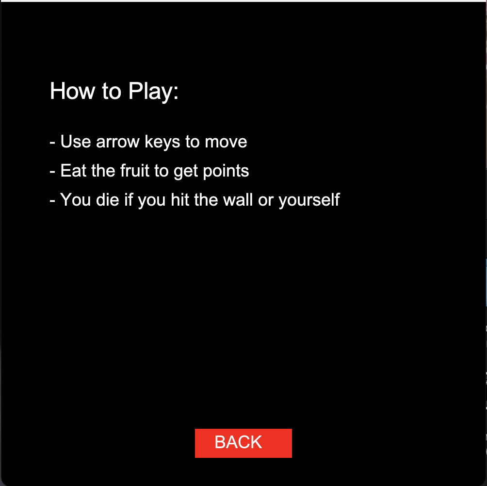

# Snake Game

A classic Snake Game built in Java for a university assignment. Control the snake to eat fruits, grow longer, and avoid crashing into walls or into yourself. The game features an interactive intro screen with buttons, a help page, and a high score system.

This project was developed as part of a university assignment using the **GameEngine** provided by Massey University.

---

## Features

- **Interactive Intro Screen**: Start the game with a "START GAME" button and access instructions via a "HELP" button.
- **Gameplay**: Control the snake using arrow keys to eat fruit and increase your score.
- **Help Screen**: View simple instructions on how to play.
- **Game Over Screen**: Displays your score and high score with an option to restart.
- **High Score Persistence**: Saves and loads the high score from a file (`highscore.txt`).

---

## Screenshots

Here are snapshots of the game in action:

| **Intro Screen**                          | **Gameplay**                            |
|-------------------------------------------|-----------------------------------------|
|  |  |

| **Help Screen**                           | **Game Over Screen**                    |
|-------------------------------------------|-----------------------------------------|
|  |  |

---

## Installation

1. **Prerequisites**:
   - Java Development Kit (JDK) 8 or higher installed.
   - A Java IDE (e.g., IntelliJ IDEA, Eclipse) or a command-line environment.

2. **Clone the Repository**:
   - Type the following into your command line:
  ```bash
git clone https://github.com/johnnycwatt/SnakeGame
cd snake-game
```

3. **Run the Game**:
  - Open the project in your IDE and run SnakeGame.java
  - Alternatively, compile and run from the command line:
  ```bash
  javac SnakeGame.java
  java SnakeGame
```

## Acknowledgments
This project was built using the GameEngine provided by Massey University, the author being D.P.Playne. You can find the source and documentation here:

[GameEngine GitHub Repository](https://github.com/a159x36/GameEngine/tree/main)

---

- **Developed by:** Johnny Chadwick-Watt
- **Date:** March 2025
- **Course:** 159261 Games Programming

   
   
